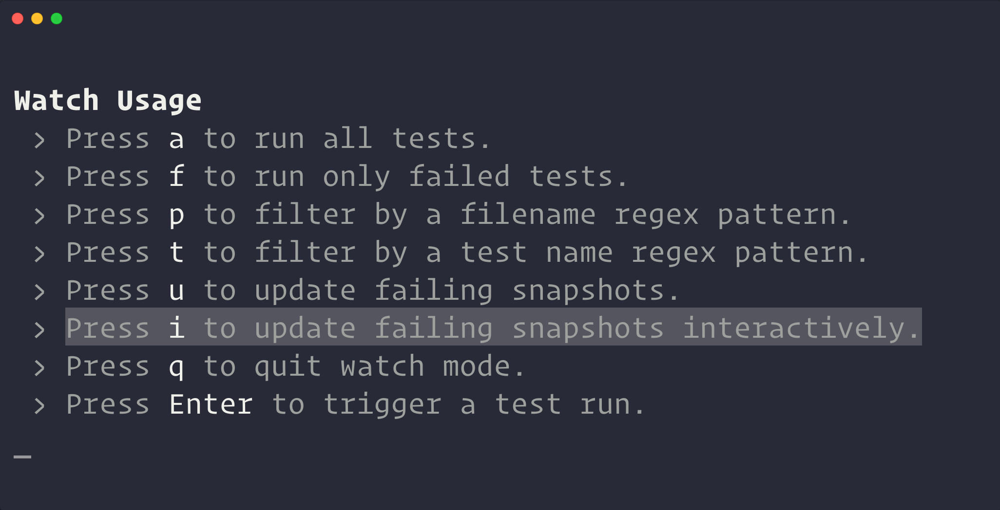
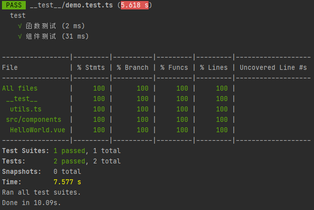

# 安装 Jest 与 配置

> 项目使用 `vue3` + `TypeScript`

## 快速安装

使用 `yarn` 安装 Jest，**建议安装26版本的 `jest`，否则在后续的配置中可能出现某些方法不兼容问题：**

```shell
yarn add --dev jest@26.6.3
```

当然，由于我们使用 `TypeScript`，故还需添加对 `TypeScript` 的支持。

```shell
yarn add --dev ts-jest@26.5.6 @types/jest
```

将如下代码添加到 `package.json` 中：

```json
{
  "scripts": {
    "test": "jest --coverage"  // --coverage 覆盖率测试
  }
}
```

至此，一个简单的 `jest` 配置就完成了。

## 支持 ES6+ 的代码测试

如果测试脚本是用 `ES6` 写的，则需要在快速配置的基础上，配置 `babel` 转码。

我们首先在**根目录下创建 `jest.config.js` 文件**，此文件是对 `jest` 的配置文件。

> `jest.config.js` API地址：https://jestjs.io/zh-Hans/docs/configuration
>
> `ts-jest` API地址：https://kulshekhar.github.io/ts-jest/

我们进行 `jest.config.js` 文件的基础配置：

```javascript
module.exports = {
  preset: "ts-jest", // Jest 配置基础的预设
  testEnvironment: 'jest-environment-jsdom-fifteen', // 测试环境。Jest 中的默认环境是 Node.js 环境。如果正在构建 Web 应用程序，则可以改用类似浏览器的环境jsdom。此处使用jsdom15，支持node8，需安装相应依赖
  moduleFileExtensions: ["ts", "tsx", "js", "jsx", "json", "node"], // 文件扩展名数组
  globals: {
    "ts-jest": {
      babelConfig: true // 启用Babel处理，使用 babel.config.js
    }
  }
}
```

安装 `jsdom15`：

```shell
yarn add --dev jest-environment-jsdom-fifteen
```

我们在根目录下创建 `babel.config.js` 文件：

```javascript
module.exports = {
  env: {
    test: {
      presets: [["@babel/preset-env", {targets: {node: 'current'}}]]
    }
  }
};
```

至此，我们已经可以执行我们用 `ES6` 写的测试代码啦。

## 支持 `Vue` 组件测试

如果我们需要测试的是 `Vue` 组件，那么我们也先需要添加相关的依赖：

```shell
yarn add --dev @vue/test-utils@next vue-jest@next babel-plugin-file-loader
```

然后，我们需要添加下 `jest.config.js` 中的相关配置，添加 `transform`配置项，使我们的 `.vue` 文件能够被“认识”。

```javascript
module.exports = {
  preset: "ts-jest", // Jest 配置基础的预设
  testEnvironment: 'jest-environment-jsdom-fifteen', // 测试环境。Jest 中的默认环境是 Node.js 环境。如果正在构建 Web 应用程序，则可以改用类似浏览器的环境jsdom。此处使用jsdom15，需安装相应依赖
  moduleFileExtensions: ["ts", "tsx", "js", "jsx", "json", "node"], // 文件扩展名数组
  transform: {
    "^.+\\.(vue|md)$": "<rootDir>/node_modules/vue-jest"
  },  // 用 `vue-jest` 处理 `*.vue` 文件
  globals: {
    "ts-jest": {
      babelConfig: true // 启用 Babel 处理，使用 babel.config.js
    }
  }
}

```

至此，关于对 `Vue` 组件的测试配置已经完成，关于如何写组件的测试代码，详情请看下文中的[组件测试](##组件测试)。

## 支持 JSX、TSX 测试

按照惯例，我们先添加相关依赖：

```shell
yarn add @vue/babel-plugin-jsx --dev
```

然后，我们需要在 `babel.config.js` 中添加相关配置

```javascript
module.exports = {
  env: {
    test: {
      presets: [["@babel/preset-env", {targets: {node: 'current'}}]],
      plugins: [["@vue/babel-plugin-jsx", {mergeProps: false}]]
    }
  }
};
```

至此，关于 JSX、TSX 的测试配置已经完成！

## 图片与 `css` 文件

如果你在你的`.vue` 或者 `.tsx` 等文件中有使用到图片，或加载了 `css` 文件，那么在测试代码执行时，就会报错。

因此，我们需要对图片等文件进行相应的处理，我们在 `jest.config.js` 文件中添加配置项：

```javascript
module.exports = {
  preset: "ts-jest", // Jest 配置基础的预设  
  testEnvironment: 'jest-environment-jsdom-fifteen', // 测试环境。Jest 中的默认环境是 Node.js 环境。如果正在构建 Web 应用程序，则可以改用类似浏览器的环境jsdom。此处使用jsdom15，需安装相应依赖 
  moduleFileExtensions: ["ts", "tsx", "js", "jsx", "json", "node"], // 文件扩展名数组  
  transform: {    
    "^.+\\.(vue|md)$": "<rootDir>/node_modules/vue-jest"  
  },  // 用 `vue-jest` 处理 `*.vue` 文件  
  moduleNameMapper: {    
  "\\.(jpg|ico|jpeg|png|gif|eot|otf|webp|svg|ttf|woff|woff2|mp4|webm|wav|mp3|m4a|aac|oga)$":      
    "<rootDir>/__test__/fileMock.ts", // 重定向至自己写的mock文件中，mock上述文件
  "\\.(css|less)$": "<rootDir>/__test__/fileMock.ts"  },   
  globals: {    
    "ts-jest": {      
      babelConfig: true // 启用 Babel 处理，使用 babel.config.js    
    }  
  }
}
```

然后，我们在根目录下创建一个 `__test__` 文件夹，并在文件夹内创建 `fileMock.ts` 文件，即我们的 `mock` 文件：

```typescript
module.exports = "";
```

## 其他

> 其他配置项可参考：https://www.jestjs.cn/docs/configuration

### 匹配测试文件

为了测试文件的统一管理，我们可以配置 `jest` 只读取某个文件夹下的测试文件，默认情况下 jest 会测试所有 `__tests__` 下的所有文件，以及任何位置的`. (test|spec).(ts|tsx|js|jsx)`
文件（`(/__tests__/.*|(\\.|/)(test|spec))\\.[jt]sx?$`）

我们可以添加 `jest.config.js` 中的 `testRegex` 项，使其只测试我们指定的 `__test__` 内的指定文件：

```javascript
module.exports = {	
  // ...    
  testRegex: "(/__test__/.*/*.(test|spec))\\.tsx?$",	
  // ...
}
```

### 匹配 alias

此外，你可能会在项目中使用 `alias`，这回导致测试时报引用错误，我们可以在 `jest.config.js` 中添加配置项，例如：

```javascript
module.exports = {	// ...    
  moduleNameMapper: {        
    "^@/(.*)$": "<rootDir>/src/$1",        
    "^@plugins/(.*)$": "<rootDir>/src/plugins/$1",        
    "^@core/(.*)$": "<rootDir>/src/core/$1"    
  }, 
  // ...
}
```

# 怎么写 Jest

> jest 使用文档：https://jestjs.io/zh-Hans/docs/getting-started
>
> vue-test-utils 使用文档：https://next.vue-test-utils.vuejs.org/guide/

## 测试文件

通常，测试脚本与所要测试的源码脚本同名，但是后缀名为`.test.js` 或者`.spec.js`

我们需要在我们创建的项目的 `__test__` 文件夹下创建一个测试文件，如 `demo.test.ts`，并搭建好基础的测试文件结构。

```javascript
describe('testDemo', () => {
  it('函数测试', () => {
  });
})
```

测试脚本里面应该包括一个或多个`describe`块，每个`describe`块应该包括一个或多个`it`块。

`describe`块称为"测试套件"（test suite），表示一组相关的测试。它是一个函数，第一个参数是测试套件的名称（"testDemo"），第二个参数是一个实际执行的函数。

`it`块称为"测试用例"（test case），表示一个单独的测试，是测试的最小单位。它也是一个函数，第一个参数是测试用例的名称（"函数测试"），第二个参数是一个实际执行的函数。

# 怎么写 Jest

> jest 使用文档：https://jestjs.io/zh-Hans/docs/getting-started
>
> vue-test-utils 使用文档：https://next.vue-test-utils.vuejs.org/guide/

## 测试文件

通常，测试脚本与所要测试的源码脚本同名，但是后缀名为`.test.js` 或者`.spec.js`

我们需要在我们创建的项目的 `__tests__` 文件夹下创建一个测试文件，如 `demo.test.ts`，并搭建好基础的测试文件结构。

```javascript
describe('testDemo', () => {
  it('函数测试', () => {
  });
})
```

测试脚本里面应该包括一个或多个`describe`块，每个`describe`块应该包括一个或多个`it`块。

`describe`块称为"测试套件"（test suite），表示一组相关的测试。它是一个函数，第一个参数是测试套件的名称（"testDemo"），第二个参数是一个实际执行的函数。

`it`块称为"测试用例"（test case），表示一个单独的测试，是测试的最小单位。它也是一个函数，第一个参数是测试用例的名称（"函数测试"），第二个参数是一个实际执行的函数。

## 函数测试

让我们开始一个简单的函数测试例子

首先我们创建一个简单的 `ts` 文件

```typescript
export function add(a: number, b: number) {
  return a + b
}
```

我们需要将其引入至测试文件中

```javascript
import {add} from "./utils";

describe('test', () => {
  it('函数测试', function () {
    expect(add(1, 1)).toBe(2)
  });
})

```

上面这句断言的意思是，调用`add(1, 1)`，结果应该等于2，所有的测试用例（it块）都应该含有一句或多句的断言。

### 断言

`jest` 中内置的 `expect`
断言还有许多，请看[官方文档](https://jestjs.io/zh-Hans/docs/expect)，比较常用的有 `.not` `.toBe(value)` `.tohaveBeenCalled()` `.toEqual(value)` `.toContain(item)`
等等

> 当比较两个对象是否相同时，需使用toEqual()，toBe()只会检查对象引用是否相同

### 安装和移除（Setup and Teardown）

`jest`中也有类似生命周期的函数，一共包括四个：

`beforeEach`、`afterEach`、`beforeAll`、`afterAll`。

用法正如他们的名称一样，前两个为每个测试执行前或执行后执行函数内部的内容，后两个在整个测试开始前或结束后执行函数内部的内容。

默认情况下，`before` 和 `after` 的块可以应用到文件中的每个测试。 此外可以通过 `describe` 块来将测试分组。 当 `before` 和 `after` 的块在 `describe`
块内部时，则其只适用于该 `describe` 块内的测试。

例如：

```javascript
import {add} from "./utils";

let a = 1;

test('testBeforeEach', () => {
  expect(add(a, 1)).toBe(2)
})

describe('test', () => {
  beforeEach(() => {
    a = 2
  })

  it('函数测试', function () {
    expect(add(a, 1)).toBe(3)
  });
})
```

### 快照测试

`jest` 可以进行快照测试，快照测试可以理解为：为 `expect()` 的结果拍一张照片，保存在本地，下一次再执行测试代码时拍一张照片，将两张照片的内容进行比较，如果存在差异，那么测试就不通过。

`toMatchSnapshot()`  方法是 `jest` 匹配快照的方法，它为 `expect` 的结果做一个快照并与前面的快照做匹配，快照内容保存在同目录下的`__snapshots__`
文件下，如果前面没有快照那就保存当前生成的快照。

```javascript
import HelloWorld from '../src/components/HelloWorld.vue'
import {mount} from "@vue/test-utils";

describe('test', () => {
  it('组件测试', function () {
    const wrapper = mount(HelloWorld, {
      props: {
        msg: 'Hello Vue 3 + TypeScript + Vite'
      }
    })
    expect(wrapper.html()).toMatchSnapshot()
  })
})
```

当然，你可以更新保存在本地的快照文件，方法为在 `jest` 指令后加上 `-u`，如 `jest -u`。

或者，你可以使用 `--watch` 监听模式下进行交互式更新



## 组件测试

首先我们引入一个 `vue` 组件

```javascript
import {add} from "./utils";
import HelloWorld from '../src/components/HelloWorld.vue';
import {mount} from "@vue/test-utils";

describe('test', () => {
  it('函数测试', function () {
    expect(add(1, 1)).toBe(2)
  });
  it('组件测试', function () {
    const wrapper = mount(HelloWorld, {
      props: {
        msg: 'Hello Vue 3 + TypeScript + Vite'
      }
    })
    expect(wrapper.get("h1").html()).toBe('<h1>Hello Vue 3 + TypeScript + Vite</h1>')
  });
})
```

我们调用 `mount` 并传递组件作为第一个参数。按照惯例，我们将结果分配给一个名为的变量 `wrapper`，因为 `mount` 它为应用程序提供了一个简单的”包装器“，我们可以理解为创建了一个 `HelloWorld`
组件，并将其赋值给wrapper。

### 包装方法

我们可以调用 `vue-test-utils` 中包装方法（正如上面我们写的 `html()` ，用于获取 html
字符串），其余方法可看 [vue-test-utils 文档](https://next.vue-test-utils.vuejs.org/api/#wrapper-methods)，常用的方法有 `exists` 、`find`
、`findAll`、`get`、setValue、`setData`、`trigger` 等等。

上文中，我们获取了组件 `h1` 元素的html字符串，并进行断言判断。

### mount 配置项

同时，我们在mount组件的时候，可以传入相关的配置项。

例如，在我们写的代码中，我们为 `HelloWorld` 组件传入属性 `msg` ，对应在组件 `props` 中属性，类似的还有`data`、`attrs`，前者用于覆盖原始的 `data` 中的数据，后者用来设置 `wrapper`
的 `html`元素的属性例如：`id`、`class`等等。

其余比较常用的配置项有：

`shallow`：对子组件存根，不进行渲染其内部

`global`：

- `provide`：若组件中有`inject`，则需要在此处 `provide` 相应的mock数据

- `plugins`：引入插件，例如在项目中使用 `store` 或 `elementUI` 等时， 需要在此处注册组件，如`plugins: [store, ElementPlus]`

> vuex 4.X 中，app.use(store, key) 中 key 的注入会使 jest 测试报错，因为无法在plugins中注入key

- `components`：若在项目中使用组件，需要在此处引入
- `directives`：若在项目中使用自定义指令，需要在此处引入

关于 `global `的其他配置项请看[文档](https://next.vue-test-utils.vuejs.org/api/#global)

# 测试结果

测试结果大致如下图所示



- %stmts是语句覆盖率（statement coverage）：是不是每个语句都执行了？
- %Branch分支覆盖率（branch coverage）：是不是每个if代码块都执行了？
- %Funcs函数覆盖率（function coverage）：是不是每个函数都调用了？
- %Lines行覆盖率（line coverage）：是不是每一行都执行了？
- %Uncovered Line #s ：哪些行没有被覆盖？

我们也可以打开 `coverage > lcov-report > index.html`  ，来查看更为优美与清晰的测试结果。

